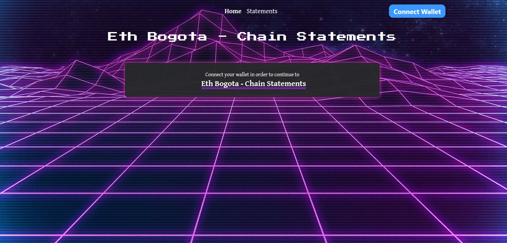
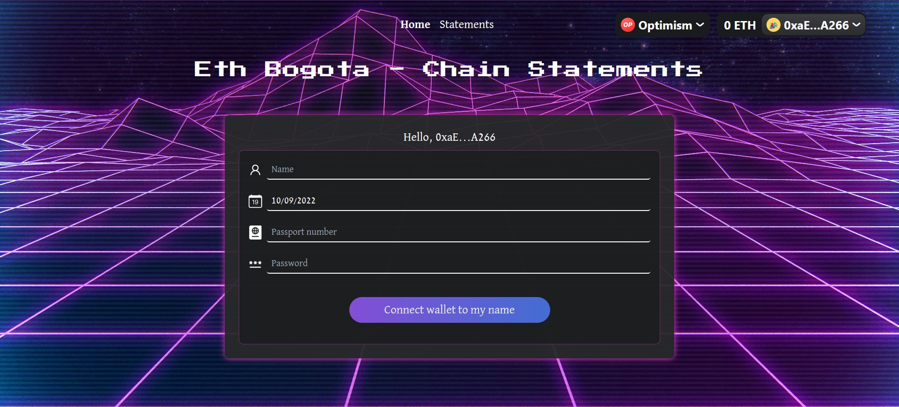
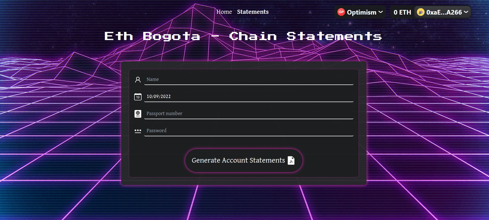

# ETH Bogota - Chain Statement

### Get your cross chain crypto assets statement without revealing your identity

We introduce a cross chain bank statement platform: **Chain Statement**, which allows users to generate their crypto asset bank statement from multiple chains, without revealing their identity on-chain.

## What Chain Statement Offer?

Unlike ordinary crypto dashboard in web3 or traditional bank statement in web2, **Chain Statement** offers the following features that will improve **privacy** and **smooth-onboarding-experience in web3**.

### Download your chain statement within few clicks

User can receive their chain statement which consits of:

1. Balance of each assets from multiple chains and addresses
2. User Name
   by generating their own identity and connect their wallets on **Chain Statement**. Once the [identity proof](https://semaphore.appliedzkp.org/docs/guides/proofs) is verified, their chain statement which stored on [IPFS](https://ipfs.tech/) will be automatically downloaded.

### Proof that you are the owner of this chain statement

It is easy to get the transactions data based on address, but how can you prove that this address belongs to you?
By using the zero knowledge features from [semaphore](https://semaphore.appliedzkp.org/), we allow user to generate unique identity which can be used to proof their identity and fetch their own chain statement.  
Users will generate their own identity based on

1. User Name
2. Birth Date
3. Passport Number
4. Password

Once the identity commitment is recorded on semaphore protocol, user only need to insert the above information again and click **generate bank statement** button. If the proof is verified on semaphore, then chain statement will be automatically download for the user. Since identity commitment doesn't reveal any information about User Name, Birth Date, Passport Number and Password, these information is zero knowledge to the public. Hence, there is no link between User Name and their addresses.

## Chain Supported

1. [Polygon](https://polygon.technology/)
2. [Optimism](https://www.optimism.io/)

## UI

1. Landing Page  
   
2. Create Identity  
   
3. Claim Chain Statement  
   
4. Chain Statement  
   
