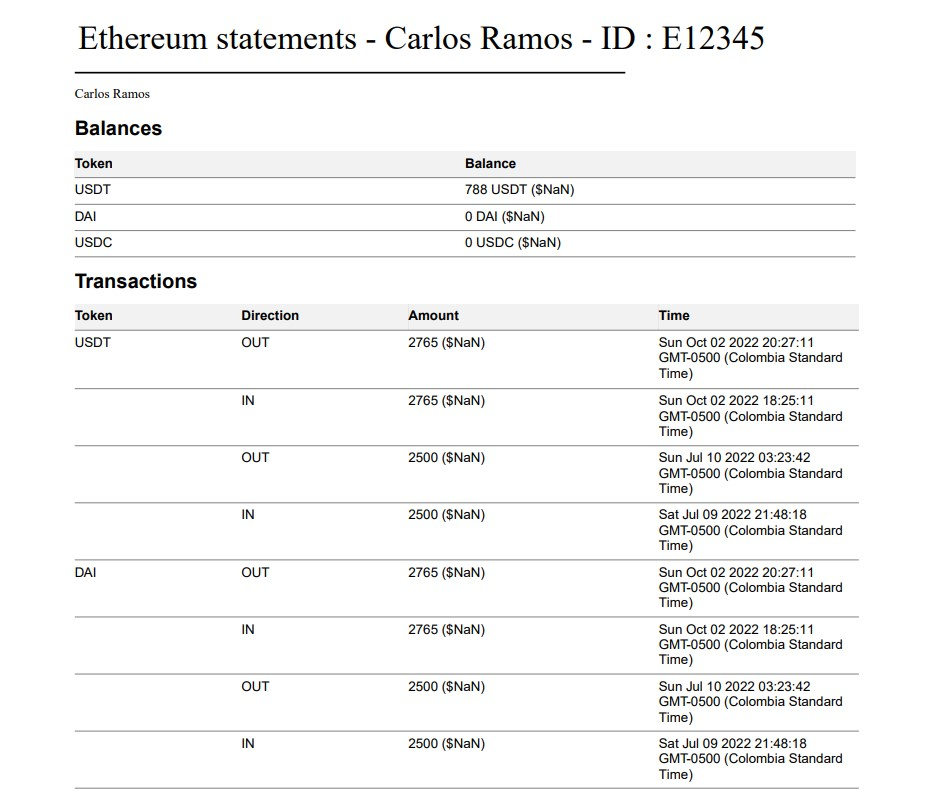

# ETH Bogota - Chain Statement 🏦

### Get your cross chain crypto assets statement without revealing your identity 🌻

We introduce a cross chain bank statement platform: **Chain Statement**, which allows users to generate their crypto asset bank statement from multiple chains, without revealing their identity on-chain.

## What Chain Statement Offer? 🪙

Unlike ordinary crypto dashboard in web3 or traditional bank statement in web2, **Chain Statement** offers the following features that will improve **privacy** and **smooth-onboarding-experience in web3**.

- Proof of Identity using zero knowledge 😊
- Decentralized Storage of Account Information 🌐
- Low-cost and lightning-fast Ethereum L2 blockchain ⚡
- User-friendly decentralised Ethereum scaling platform 💸

### Proof of Identity using zero knowledge 😊

It is easy to get the transactions data based on address, but how can you prove that this address belongs to you?
By using the zero knowledge features from [semaphore](https://semaphore.appliedzkp.org/), we allow user to generate unique identity which can be used to proof their identity and fetch their own chain statement.  
Users will generate their own identity based on

1. User Name
2. Birth Date
3. Passport Number
4. Password

Once the identity commitment is recorded on semaphore protocol, user only need to insert their information again and our platform will automatically generate proof for user. Once they are verified, they can download chain statement immediately.

### Decentralized Storage of Account Information 🌐

We are aware that censorship is a big problem in traditional financial services. Thus, we solve this problem by storing our user's chain statement on [IPFS](https://ipfs.tech/), in a form of PDF which consists of:
User can receive their chain statement which consits of:

1. Balance of each assets from multiple chains and addresses
2. User's Name
3. User's Passport Number

### Low-cost and lightning-fast Ethereum L2 blockchain ⚡

We don't want our users to pay high gas fee for just a simple generating chain statement request. Hence, our smart contract is deployed on [Optimism](https://www.optimism.io/), which is a Optimisitic-Rollup L2 blockchain that has low-cost and lightning-fast transaction experience.

### User-friendly decentralised Ethereum scaling platform 💸

User-friendly is also another main consideration for us when we're developing **Chain Statement**. With cheap transaction fee, strong community support and user-friendly characteristics, we deployed our smart contract to [Polygon](https://polygon.technology/).

## UI 💜

1. Landing Page  
   
2. Create Identity  
   
3. Claim Chain Statement  
   
4. Chain Statement  
   
